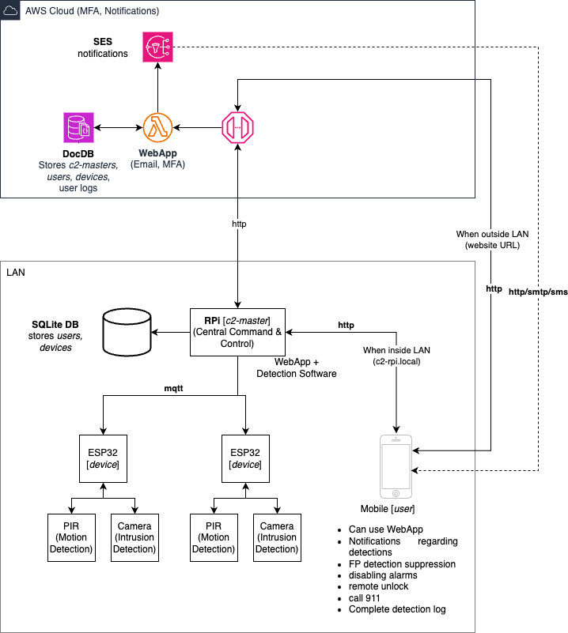

# README

## Intrusion Detection System with MQTT Integration

This repository contains a Python application for an Intrusion Detection System (IDS) with MQTT integration. The system is designed to detect potential intrusions at a site by combining WiFi-based detection and Machine Learning-based face/posture detection.



### Features

- **MQTT Integration:** The application uses the MQTT protocol for communication between the Raspberry Pi (RPi) and the user interface.

- **WiFi-Based Detection:** The system checks for connected devices via WiFi to detect unregistered devices, triggering an alarm if necessary.

- **Machine Learning-Based Detection:** The application performs face/posture detection using Machine Learning techniques. The detection results are weighted and combined with WiFi-based results.

- **SQLite Database:** The system stores registered users, devices, and activity logs in an SQLite database.

- **Flask Web Interface:** The application provides a web interface built with Flask for users to view intrusion alerts, respond to alerts, and view recorded video logs.

- **Email Notifications:** The system sends email notifications to users when potential intrusions are detected.

### Prerequisites

- Python 3
- Flask
- Paho MQTT Client
- Flask-SQLAlchemy
- Requests
- Schedule
- SQLite
- MQTT Broker (e.g., Mosquitto)

### Configuration

1. Install the required dependencies using `pip install -r requirements.txt`.

2. Configure the system by updating the `config.yml` file with appropriate values. Ensure the MQTT broker is running.

3. Initialize the SQLite database by running `python manage.py create_tables`.

### Usage

1. Run the Flask application with `python rpi.py` from `project_root/rpi` directory. The application will listen on `http://0.0.0.0:8080/` by default.

2. The Flask web interface provides access to intrusion alerts, video logs, and response options.

3. Intrusion alerts are received via MQTT from the RPi. Detected intrusions trigger alerts, and users can view associated video logs.

4. Users can respond to alerts by confirming or suppressing them through the web interface.

### Additional Notes

- The application includes placeholder values for certain configurations and functionalities. Ensure to customize them according to your environment.

- Video logs are saved in the `activity_vlogs` directory. Ensure proper permissions for file operations.

- The system periodically checks for registered devices connected to the WiFi network and triggers an alarm if unregistered devices are detected.

- The intrusion detection system is designed to be extensible. You can enhance the Machine Learning-based detection algorithm and further customize functionalities.

## Installation

1. Clone the Repository
    ```bash
    git clone https://github.com/UntitledError-09/csc591-iot-project.git
    cd csc591-iot-project
    ```
2. Create and Activate a Conda Environment
    ```bash
    conda create --name csc591-iot-project python=3.11
    conda activate csc591-iot-project
    ```
3. Install Dependencies
    ```bash
    pip install -U -r requirements.txt
    ```
4. Run the Application
   - On rpi:
    ```bash
    cd rpi
    python rpi.py
    ```
5. Visit http://<device-ip>:8080/render_template_route in your web browser to access the home page.

Feel free to enhance and adapt the system based on your specific needs. If you encounter any issues or have suggestions for improvements, please raise an issue or contribute to the project.

### Contributors
- Harish Rohan Kambhampaty
- Aboli Kulkarni
- Chunduru Chetana
- Shameek Khadilkar

# License

Copyright (c) 2024 Harish Rohan Kambhampaty, Aboli Kulkarni, Chunduru Chetana, Shameek Khadilkar

Permission is hereby granted, free of charge, to any person obtaining a copy of this software and associated documentation files (the “Software”), to deal in the Software without restriction, including without limitation the rights to use, copy, modify, merge, publish, distribute, sublicense, and/or sell copies of the Software, and to permit persons to whom the Software is furnished to do so, subject to the following conditions:

The above copyright notice and this permission notice shall be included in all copies or substantial portions of the Software.

THE SOFTWARE IS PROVIDED “AS IS”, WITHOUT WARRANTY OF ANY KIND, EXPRESS OR IMPLIED, INCLUDING BUT NOT LIMITED TO THE WARRANTIES OF MERCHANTABILITY, FITNESS FOR A PARTICULAR PURPOSE AND NONINFRINGEMENT. IN NO EVENT SHALL THE AUTHORS OR COPYRIGHT HOLDERS BE LIABLE FOR ANY CLAIM, DAMAGES OR OTHER LIABILITY, WHETHER IN AN ACTION OF CONTRACT, TORT OR OTHERWISE, ARISING FROM, OUT OF OR IN CONNECTION WITH THE SOFTWARE OR THE USE OR OTHER DEALINGS IN THE SOFTWARE.
